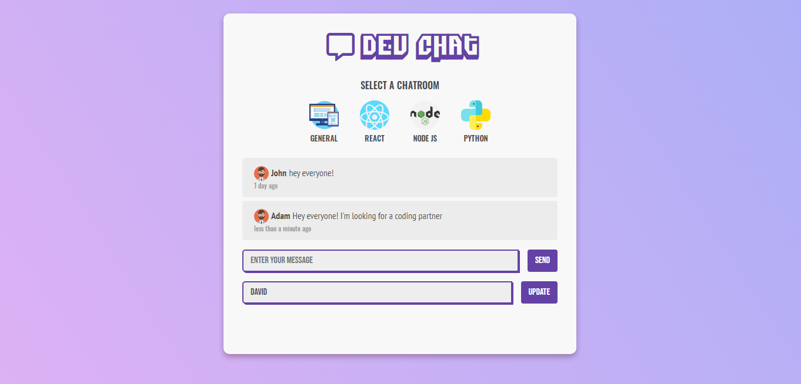

# Real Time Chat Application

Build a Real Time Chat Application to practice Advanced Javascript Concepts like: 
- Classes and Constructors
- Async/Await and Promises
- Firebase Database Real Time Listeners
- LocalStorage

**Demo** [here](https://tjgillweb.github.io/Real-Time-Chat-Application/).

